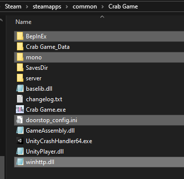
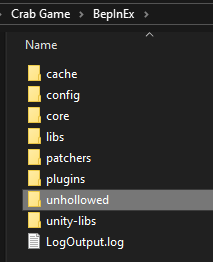
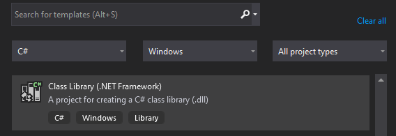
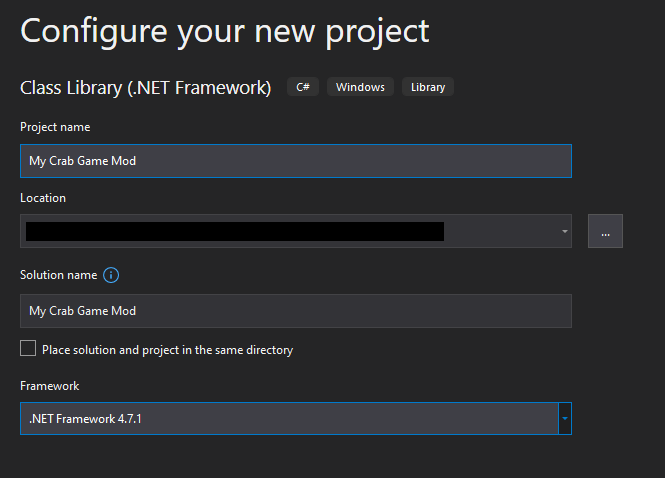
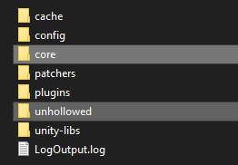
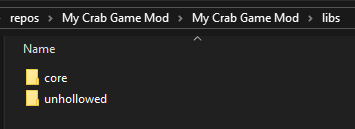
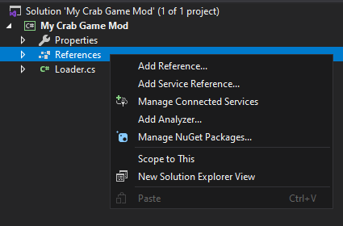

This Repo will help you create your first Crab Game Mod!

# Setup
Before anything else, you'll need BepInEx 6.0 for IL2CPP, as Crab Game is an IL2CPP game meaning it's obfuscated and its more annoying to mod. You'll also need Visual Studio

Download BepInEx 6.0 Preview [here](https://github.com/BepInEx/BepInEx/releases/v6.0.0-pre.1)

Once downloaded, extract it and put BepInEx, Mono, doorstop.ini and winhttp.dll int Crab Game's root folder. To do this, open Steam, locate Crab Game in your Library, right click then click Manage, then click Browse local Files.
<p align="center">
</p>

Now, run Crab Game then close it. If you go back to the root folder and into the Bepinex folder, you should see a folder called 'unhollowed' which means it decompiled the game!
<p align="center"></p>

After this point, you'll need to use Visual Studio, and you'll need to create a new **Class Library (.NET Framework)** project
<p align="center"></p>

Set the .NET Framework to anywhere up to 4.8, but 4.7.1 works best
<p align="center"></p>

Now, you're going to want to copy the 'core' and 'unhollowed' folders. Go to your project's folder, create a new folder called 'libs' and paste the two folders in there
<p align="center">
</p>

After that, you'll need to add references. Go to the Explorer window in Visual Studio, and click Add References. Add all of the DLL's in the libs subfolders
<p align="center"></p>

# Let's start coding!
Let's get to the fun part: Coding! The first step is to renaming Class1.cs to Plugin.cs

Then, paste this code in and change what you need:
```cs
using BepInEx;
using BepInEx.IL2CPP;
using HarmonyLib;

// credits to lammas123, Danilo1231, JD3006, and Lualttt
// original file at https://github.com/Lualttt/crabgame_template_plugin/blob/master/Plugin.cs
namespace CrabGameMod
{
    // other templates never included this...
    // at least lammas123 used strings, but ofc it was less readable
    class PluginInfo // holds information about our mod
    {
        public const string PLUGIN_GUID = "CrabGameMod"; // change this to the name of your mod
        public const string PLUGIN_NAME = "CrabGameMod"; // change this to the name of your mod
        public const string PLUGIN_VERSION = "1.000";
        public const string PLUGIN_CREATOR = "ModCreator"; // change this to your github username, or discord username, or whatever
    }

    // Plugin information
    [BepInPlugin(PluginInfo.PLUGIN_CREATOR, PluginInfo.PLUGIN_NAME, PluginInfo.PLUGIN_VERSION)]
    public class CrabGameModPlugin : BasePlugin
    {
        public override void Load()
        {
            // make sure to call it Runtime Hooks we're trying to apply
            // so we sound like we know what we are doing
            Log.LogMessage("Attempting to apply Runtime Hooks...");
            try
            {
                Harmony.CreateAndPatchAll(typeof(Patches));

                Log.LogMessage("Applied Runtime Hooks of mod " + PluginInfo.PLUGIN_NAME + " v" + PluginInfo.PLUGIN_VERSION);
            } 
            catch
            {  
                Log.LogError("Failed to apply Runtime Hooks!");
            }
        }
    }
}
```

If you notice at one of the lines, it's looking for a class named *Patches*, which we haven't added of course. The file is availble in the repo, but if you want to copy and paste from right here, you can go ahead. I recommend leaving the contents alone, as it has what you need.
```cs
using BepInEx.IL2CPP.Utils;
using HarmonyLib;
using UnityEngine;

// declarations like these avoid the use of these obfuscated values
// and make code easier to read!
using EffectManager = MonoBehaviourPublicGataInefObInUnique;
using LobbyManager = MonoBehaviourPublicCSDi2UIInstObUIloDiUnique;

// credits to lammas123, and o7moon
// original file at https://github.com/lammas321/CrabGameFloatingPlayerPatch/blob/main/FloatingPlayerPatch/Patches.cs
namespace CrabGameMod
{
    internal class Patches
    {
        // Anti Bepinex detection (thanks o7Moon https://github.com/o7Moon/CrabGame.AntiAntiBepinex)

        // Ensures effectSeed is never set to 4200069 (if it is, modding has been detected)
        [HarmonyPatch(typeof(EffectManager), nameof(EffectManager.Method_Private_Void_GameObject_Boolean_Vector3_Quaternion_0))]

        // Ensures connectedToSteam stays false (true means modding has been detected)
        [HarmonyPatch(typeof(LobbyManager), nameof(LobbyManager.Method_Private_Void_0))]

        // Would ensure snowSpeed is never set to Vector3.zero, but it is immediately set back to Vector3.one due to an accident on Dani's part lol
        //[HarmonyPatch(typeof(SnowSpeedModdingDetector), nameof(SnowSpeedModdingDetector.Method_Private_Void_0))] 
        
        [HarmonyPrefix]
        public static bool PreBepinexDetection() => false;

        // And your extra code here
        // If you use more files, make sure they are in the Plugin.cs file as Harmony.CreateAndPatchAll(typeof(FileName)); alongside the other ones
    }
}
```

# The Final Step: Building the DLL
In the top middle area on your screen, it might say Debug. If it is Release, that's good! If it's Debug, then click on it and set it to Release.

Now you can quickly build your mod by hitting Ctrl+B, or going to the Build tab and clicking Build. You'll find the mod dll in the folder of your project

To use your mod, copy it from your project, and paste it into **Bepinex\plugins**, then run Crab Game.

### If you create a cheat menu, DON'T USE IT IN A WAY THAT GIVES YOU AN UNFAIR ADVANTAGE!! 
**Plus hosts can kick & ban you**

# Decompiling
(Just about everything you need is at Deobfuscation.cs in the repo)

If you want to look at the game internally, you can get the [UnityExplorer mod](https://github.com/sinai-dev/UnityExplorer/releases/tag/4.5.5) (the IL2CPP BepInEx version), extract it, and paste the dll into *BepInEx/plugins** where you'd put your mod

# Sources & Links

- https://github.com/JD3006/Modding-Crabgame
- https://github.com/lammas321/CrabGameFloatingPlayerPatch/blob/main/FloatingPlayerPatch/Deobfuscation.cs
- https://github.com/lammas321/CrabGameFloatingPlayerPatch/blob/main/FloatingPlayerPatch/Patches.cs
- https://github.com/Danilo1301/crab-game-mod
- https://github.com/Lualttt/crabgame_template_plugin/blob/master/Plugin.cs
- https://github.com/o7Moon/CrabGame.AntiAntiBepinex
